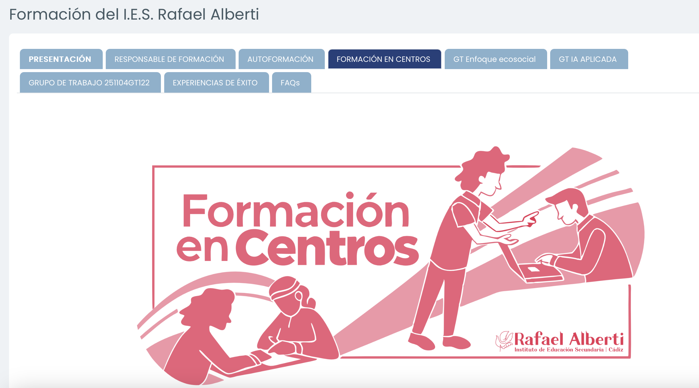

<h2 class="r-fit-text" style="text-align: center"> VISIÓN COMPARTIDA, COMPETENCIAS CLAVE E INCLUSIÓN EDUCATIVA EN EL IES RAFAEL ALBERTI </h2>

---
## Asistencia

---

## Repaso del curso de Moodle

<small>https://educacionadistancia.juntadeandalucia.es/centros/cadiz/course/view.php?id=278&section=3</small>

---

## Contenidos

Apuesta por una autoformación horizontal <!-- .element: class="fragment" -->

Diferentes concreciones para elegir <!-- .element: class="fragment" -->

Todos/as tenemos algo que compartir <!-- .element: class="fragment" -->

Competencias clave y didáctica

Digitalización e inclusión <!-- .element: class="fragment" -->

Experiencias destacadas en otros centros (Erasmus+) <!-- .element: class="fragment" -->

¿En qué están trabajando otros/as compañeros/as? <!-- .element: class="fragment" -->
---

## Planificación de sesiones

Sesión 1 (Guía digital): 9 de septiembre de 9:30 a 14:00 <!-- .element: class="fragment" -->

Sesión 2 (Presentación del resto de sesiones): Hoy <!-- .element: class="fragment" -->

Sesión 3 (Buenas prácticas competencias clave y digitalización): Lunes 20 enero de 15:30 a 17:30<!-- .element: class="fragment" -->

Sesión 4 (Buenas prácticas competencias clave e inclusión): Martes 11 febrero de 16:30 a 18:30

Sesión 5 (Erasmus+): Lunes 17 marzo de 15:30 a 17:30 <!-- .element: class="fragment" -->

Sesión 6 (Conclusiones grupos de trabajo): Martes 29 abril de 16:30 a 18:30
---

## Requisitos de certificación

Mínimo de 30 horas, máximo de 80 <!-- .element: class="fragment" -->

30 horas: Asistencia 100% de las sesiones <!-- .element: class="fragment" -->

Próximamente tabla de cómputo disponible <!-- .element: class="fragment" -->
---
<!-- .slide: data-background-video="../assets/5359629-hd_1920_1080_30fps.mp4" data-background-opacity="0.6" data-background-video-loop data-background-video-muted-->

## ¿Dudas?
