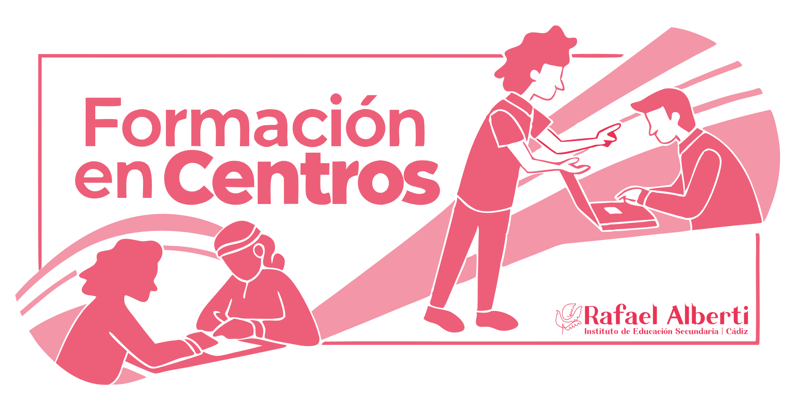
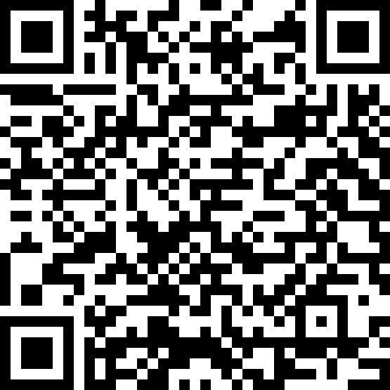
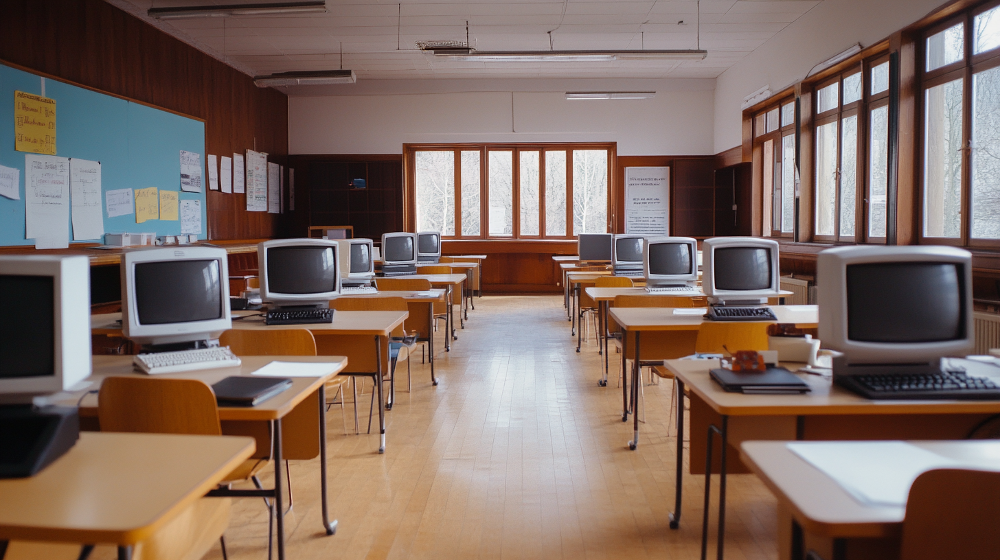
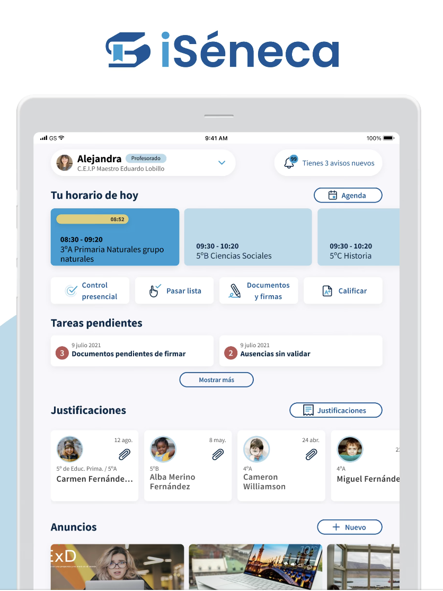
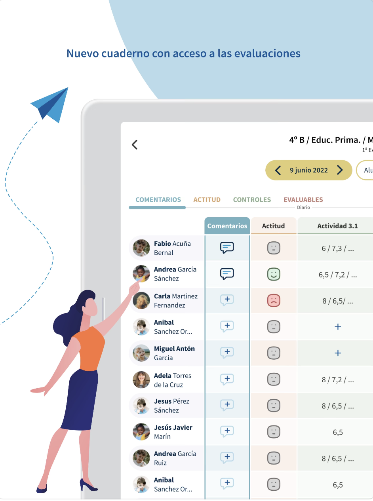
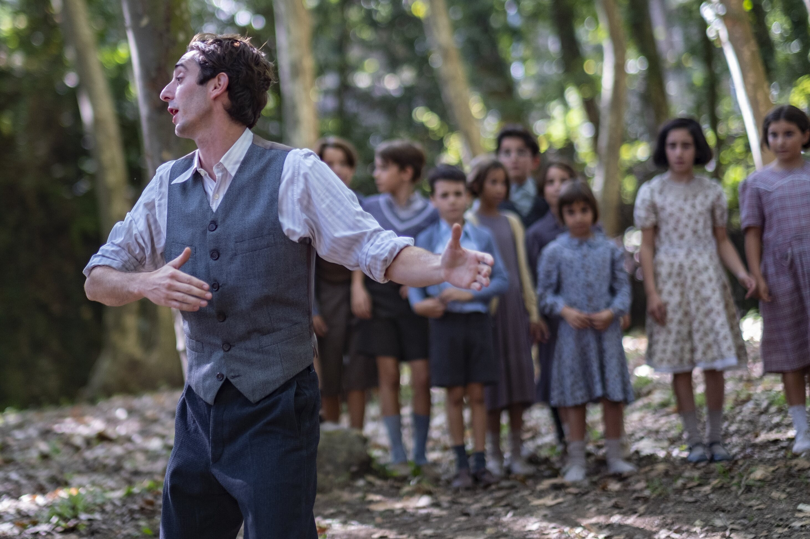

<h2 class="r-fit-text" style="text-align: center"> VISIÓN COMPARTIDA, COMPETENCIAS CLAVE E INCLUSIÓN EDUCATIVA</h2>

---
## Asistencia

---

## Buenas prácticas y digitalización

---

## La didáctica del podcast

---

## La productividad de las programaciones

---

## La nueva APP de Séneca

## Antes que nada

¿Sabemos activar servicios?

## Firmar

<video width=250 src="../assets/firma-biometrica.MP4" controls />

## Incidencias de entrada/salida

<video width=250 src="../assets/incidencia-presencia.MP4" controls />

## Cuaderno del profesorado

---

## El método Freinet en digital

---

## Tareas

Próximamente <!-- .element: class="fragment" -->

Opción 1: Desarrollar uno de los apartados <!-- .element: class="fragment" -->

Opción 2: Tarea más sencilla para certificar aprovechando todas las sesiones <!-- .element: class="fragment" -->

---

## Próximas sesiones

Sesión 4 (Buenas prácticas competencias clave e inclusión): Martes 11 febrero de 16:30 a 18:30

Sesión 5 (Erasmus+): Lunes 17 marzo de 15:30 a 17:30 <!-- .element: class="fragment" -->

Sesión 6 (Conclusiones grupos de trabajo): Martes 29 abril de 16:30 a 18:30 <!-- .element: class="fragment" -->
---
<!-- .slide: data-background-video="../assets/5359629-hd_1920_1080_30fps.mp4" data-background-opacity="0.6" data-background-video-loop data-background-video-muted-->

## ¿Dudas?
