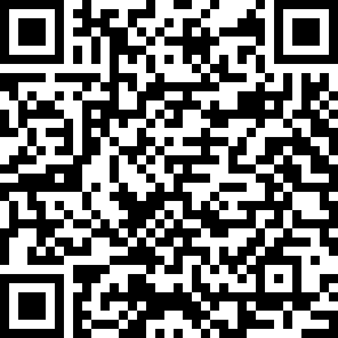
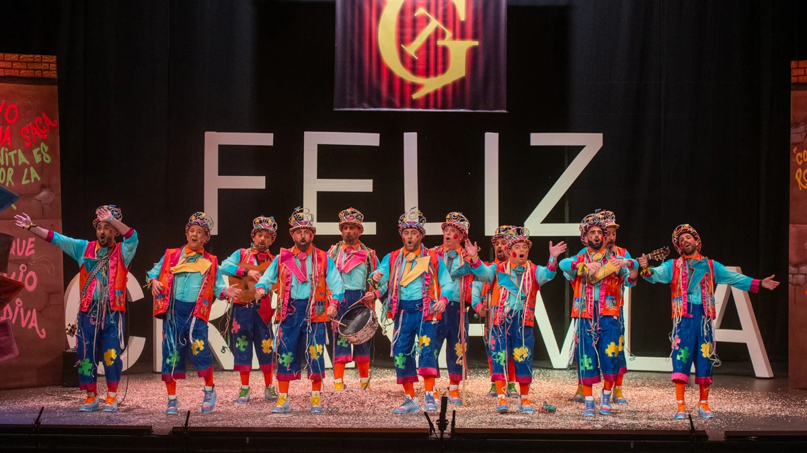

<h2 class="r-fit-text" style="text-align: center"> VISIÓN COMPARTIDA, COMPETENCIAS CLAVE E INCLUSIÓN EDUCATIVA</h2>

---
## Asistencia

---

## Buenas prácticas e inclusión

---
## DUA y Evaluación

---
## Herramientas de accesibilidad

<small>https://www.microsoft.com/es-es/education/learning-tools/accessibility-tools</small>

## OpenDyslexic

<small>https://opendyslexic.org</small>
---
## El plan lector

Note:

Perplexity + Lienzo ChatGPT: Creación de lecturas y ejercicios de comprensión lectora
---

## Tareas

Próximamente <!-- .element: class="fragment" -->

Opción 1: Desarrollar uno de los apartados <!-- .element: class="fragment" -->

Opción 2: Tarea más sencilla para certificar aprovechando todas las sesiones <!-- .element: class="fragment" -->
---
## Repaso de las tareas de la sesión anterior
---

## Próximas sesiones

Sesión 5 (Erasmus+): Lunes 17 marzo de 15:30 a 17:30

Sesión 6 (Conclusiones grupos de trabajo): Martes 29 abril de 16:30 a 18:30 <!-- .element: class="fragment" -->
---
<!-- .slide: data-background-video="../assets/5359629-hd_1920_1080_30fps.mp4" data-background-opacity="0.6" data-background-video-loop data-background-video-muted-->

## ¿Dudas?
