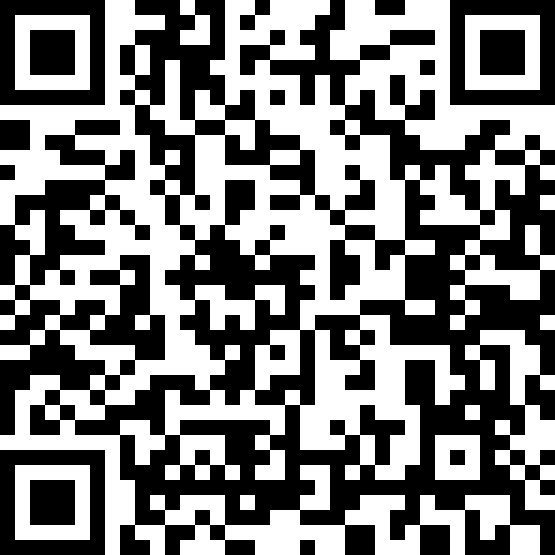
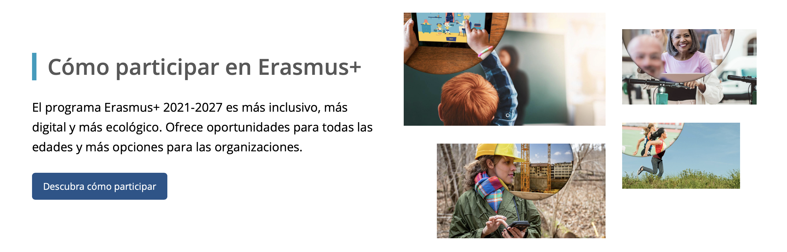

<h2 class="r-fit-text" style="text-align: center"> VISIÓN COMPARTIDA, COMPETENCIAS CLAVE E INCLUSIÓN EDUCATIVA</h2>

---
## Asistencia

---

## Erasmus+

---
## Encontrando respuestas en la guía Erasmus+

Note:

http://sepie.es/comunicacion/newsletter.html

https://erasmus-plus.ec.europa.eu/es
---

## Tareas

Próximamente <!-- .element: class="fragment" -->

Opción 1: Desarrollar uno de los apartados <!-- .element: class="fragment" -->

Opción 2: Tarea más sencilla para certificar aprovechando todas las sesiones <!-- .element: class="fragment" -->
---
## Repaso de las tareas de la sesión anterior
---

## Última sesión

Sesión 6 (Conclusiones grupos de trabajo): Martes 29 abril de 16:30 a 18:30
---
<!-- .slide: data-background-video="../assets/5359629-hd_1920_1080_30fps.mp4" data-background-opacity="0.6" data-background-video-loop data-background-video-muted-->

## ¿Dudas?
