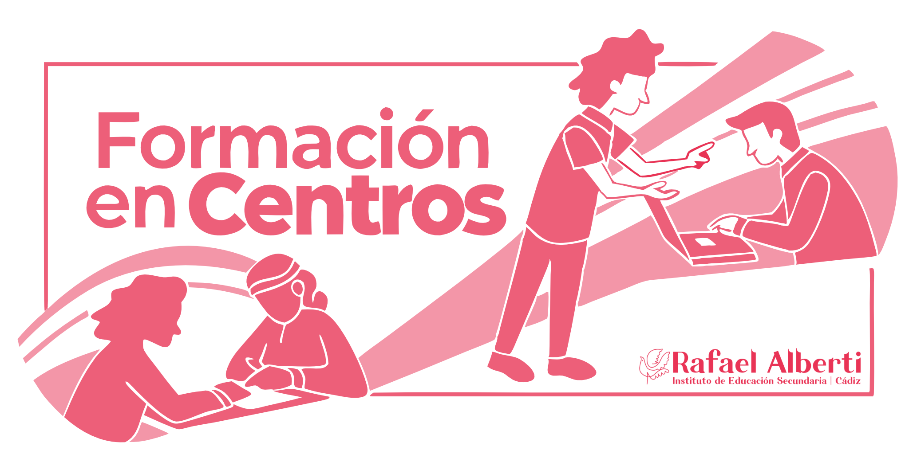
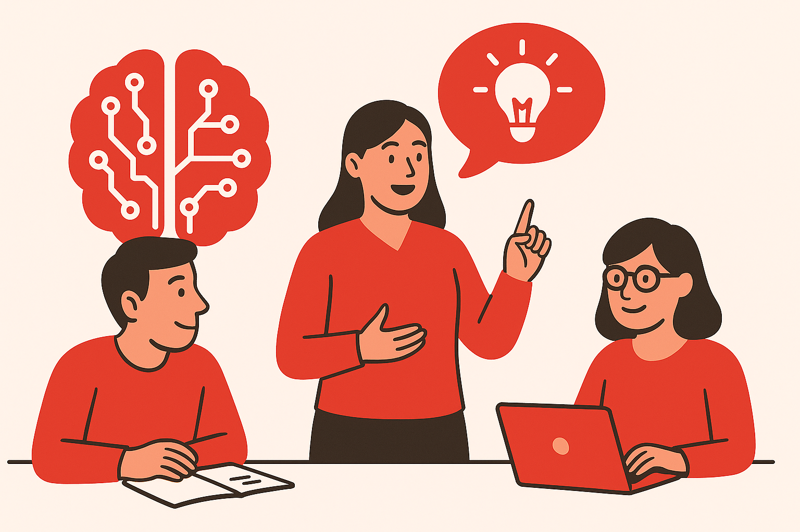

<h2 class="r-fit-text" style="text-align: center"> VISIÓN COMPARTIDA, COMPETENCIAS CLAVE E INCLUSIÓN EDUCATIVA</h2>

---
## Asistencia

---

## Conclusiones de los grupos de trabajo

---
## Grupo de Inteligencia Artificial

---
## Comunicando en Google Sites

---
## Grupo de Comunicación Lingüística

---

## Tareas

Próximamente <!-- .element: class="fragment" -->

Opción 1: Desarrollar uno de los apartados <!-- .element: class="fragment" -->

Opción 2: Tarea más sencilla para certificar aprovechando todas las sesiones <!-- .element: class="fragment" -->
---
## Plazo de entrega de tareas

16 de mayo
---
<!-- .slide: data-background-video="../assets/5359629-hd_1920_1080_30fps.mp4" data-background-opacity="0.6" data-background-video-loop data-background-video-muted-->

## ¿Dudas?
